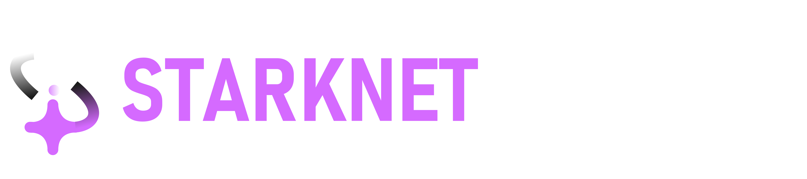

<p align="center">

</p>

| Demo Status | Brian AI | Platform |
|------------|----------|-----------|
| [](https://github.com/starknet-finance) | [](https://www.brianknows.org/) | [](https://starknet.io) |

# Starknet Finance
Next-Gen Account Management for Starknet

## One Dashboard for Everything
Starknet Finance is revolutionizing how users interact with DeFi by combining AI-powered operations, smart batching, and seamless team management into one powerful platform.

## Core Features

### 🚀 Smart Operations
- Visual batch transaction builder
- AI-powered automation
- Natural language commands
- Real-time transaction tracking

### 🛠 Flexible Account Setup
- Personal wallets with smart features
- Team treasury management
- Customizable modular features
- Built on Account Abstraction

### 🔌 Seamless Integrations
- Major wallet support
- Team collaboration tools
- Telegram & Slack notifications
- Custom webhook support

## Built For

### Power Users
- Advanced DeFi operations
- AI-powered automation
- Custom operation flows

### Teams
- Collaborative treasury management
- Real-time notifications
- Streamlined workflows

### Enterprise
- Professional-grade tools
- Advanced security features
- Custom integration support

## Quick Start
```bash
yarn install
yarn dev
